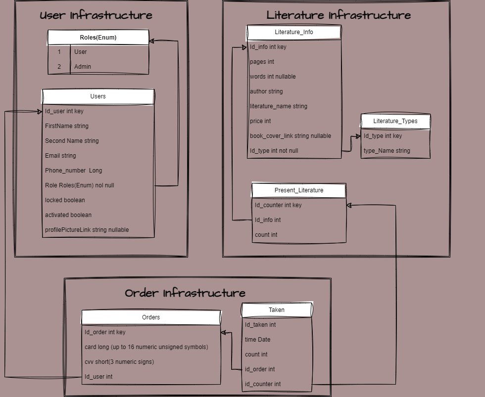

# Contents
- [Contents](#contents)
- [Intro](#intro)
  - [Background](#background)
  - [Issues](#issues)
  - [Team Composition](#team-composition)
# Intro
This is a project that simulates client- and admin-side of an online bookshop(but at moment only on local machine).

Here are going to be used such Java technologies like: 
* Spring Boot,
* Spring Web,
* Spring Security,
* Spring Data JPA,
* Spring Mail I/O,
* Hibernate.

And some Front-end technologies like TScript and Angular framework.

Here is the DataBase Structure:

## Setup

 

## Issues

## Team Composition